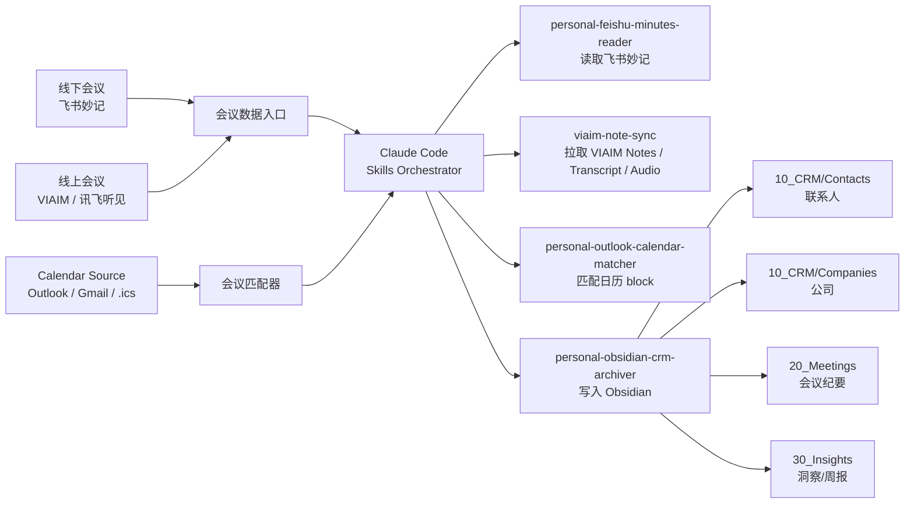
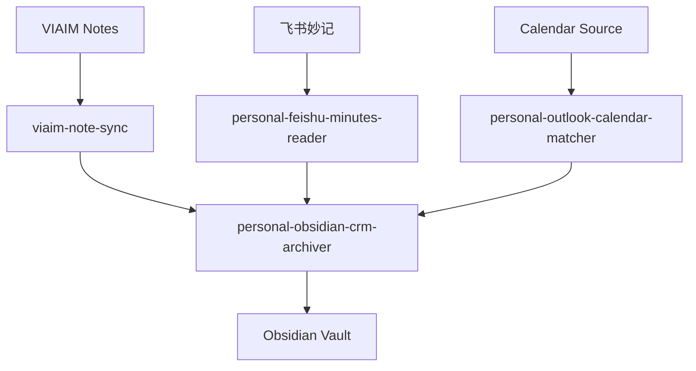

# 个人 CRM + 录音管理系统：Claude Code 执行方案 v3

> 这份文档可以直接交给 Claude Code。Claude Code 的任务不是“解释方案”，而是按本文步骤在指定 Obsidian vault 文件夹里完成初始化、接入、归档和自动化。

## 0. Claude Code 立即执行清单

如果用户已经指定 Obsidian vault 路径，先执行：

```bash
python /path/to/setup_personal_crm_vault.py --vault "/absolute/path/to/ObsidianVault"
```

如果用户没有指定路径，先询问一句：

```text
请提供 Obsidian vault 的绝对路径；如果还没有 vault，请提供希望创建的位置。
```

执行完成后，Claude Code 应确认：

```text
已创建目录结构
已写入联系人模板
已写入会议模板
已写入公司模板
已写入系统配置
```

然后继续安装或加载这些 Skills：

```text
personal-crm-bootstrap
personal-feishu-minutes-reader
personal-outlook-calendar-matcher
personal-obsidian-crm-archiver
viaim-note-sync
```

## 1. Executive Summary

本系统目标是搭建一个本地优先的个人关系记忆系统，把录音、转写、日历、会议纪要和联系人 CRM 打通。

推荐技术路线：

- **Claude Code**：后台 agent，直接在 Obsidian vault 文件夹中工作。
- **Obsidian**：前端查看、搜索和轻量编辑界面。
- **飞书妙记**：线下会议的录音与转写入口。
- **VIAIM / 讯飞听见**：讯飞耳机线上会议的 transcript 和音频来源。
- **Calendar Source**：优先读工作 Outlook Calendar；若当前环境不能接入，则用 Gmail/Google Calendar 或 `.ics` 作为 Codex 可读的日历入口。
- **Skills + scripts**：固化工作流，减少手动操作。

核心自动化链路：

```text
飞书妙记 / VIAIM Notes / 讯飞音频
        + Outlook 日历
        ↓
Claude Code 匹配会议和联系人
        ↓
自动写入 Obsidian 联系人 CRM、会议纪要、公司档案、待办和洞察
```

关键判断：

- 不再依赖人手动建目录和复制模板，初始化由脚本完成。
- VIAIM 端优先自动拉取 transcript 和音频到本地，不一定先推飞书。
- 音频推送到飞书妙记可做，但优先级低于“直接从 VIAIM transcript 归档”，因为飞书公开 API 更确定的是读取已有妙记文字记录，而不是通过标准 API 上传任意音频并触发生成妙记。

## 2. 系统架构示意



## 3. 自动初始化 Obsidian Vault

不要手动建立目录。Claude Code 应运行 bootstrap 脚本：

```bash
python setup_personal_crm_vault.py --vault "/absolute/path/to/ObsidianVault"
```

脚本负责创建：

```text
00_Inbox/
  Audio/
  Transcripts/
  FeishuLinks/
  VIAIM/
    Audio/
    Transcripts/
    Exports/
10_CRM/
  Contacts/
  Companies/
  Networks/
20_Meetings/
30_Insights/
  Weekly/
40_Projects/
80_Templates/
90_Attachments/
  Audio/
  Transcripts/
.crm-system/
  config.json
  run-log.md
```

脚本还会自动写入：

```text
80_Templates/crm-contact-template.md
80_Templates/meeting-note-template.md
80_Templates/company-template.md
80_Templates/weekly-review-template.md
```

## 4. 操作 Manual

### 4.1 第一次安装

需要用户手动完成的只有三件事：

1. 安装 Obsidian。
2. 安装 Claude Code。
3. 登录飞书、VIAIM、Outlook 所需账号并授权。

其余由 Claude Code 执行：

```bash
python setup_personal_crm_vault.py --vault "<vault_path>"
```

### 4.2 飞书妙记接入

Claude Code 使用 `personal-feishu-minutes-reader`。

#### 4.2.1 后台配置

在飞书开放平台创建自建应用后，先完成后台配置：

1. 进入应用的「凭证与基础信息」，取得 `App ID` 和 `App Secret`。
2. 进入「安全设置」，添加 OAuth 重定向 URL：

```text
http://localhost:9876/callback
```

3. 进入「权限管理」，申请并发布以下权限：

```text
minutes:minutes.search:read
minutes:minutes:readonly
minutes:minutes.transcript:export
contact:user.base:readonly
drive:drive:readonly
docx:document
search:docs:read
calendar:calendar:readonly
```

对应中文权限包括：搜索妙记、查看妙记、导出妙记转写文字、获取用户基本信息、查看云空间文件、文档读取/管理、搜索云文档、查看日历。

注意：即使是个人使用，飞书开放平台应用也挂在一个租户/组织下。权限变更通常需要发布新版本并通过管理员审核；如果当前账号就是该空间管理员，可在管理后台自行审核。

#### 4.2.2 本地配置

在项目根目录创建 `.env`。该文件已被 `.gitignore` 排除，不应提交：

```text
FEISHU_APP_ID=<app_id>
FEISHU_APP_SECRET=<app_secret>
```

如果 `App Secret` 曾经暴露到聊天或文档中，正式使用前应在飞书后台重新生成。

#### 4.2.3 OAuth 授权

首次授权或新增权限后重新授权：

```bash
python3 skills-src/personal-feishu-minutes-reader/scripts/feishu_minutes_reader.py --action auth_status
python3 skills-src/personal-feishu-minutes-reader/scripts/feishu_minutes_reader.py --action oauth_url
python3 skills-src/personal-feishu-minutes-reader/scripts/feishu_minutes_reader.py --action exchange_code --auth-code "<code>"
```

`oauth_url` 输出的链接需要由用户在浏览器中打开并授权。授权后浏览器会跳转到：

```text
http://localhost:9876/callback?code=<code>&state=personal_feishu_minutes
```

页面打不开是正常的，因为本地没有启动 Web server；只需要复制地址栏里的 `code`。`code` 通常有效期很短且只能使用一次。

授权成功后，本地 token 会保存到：

```text
~/.personal_feishu_user_token.json
```

#### 4.2.4 搜索历史妙记

不要只做空搜索。实测飞书空搜索可能返回 `items: []`，即使账号里有历史妙记。应优先带时间范围：

```bash
python3 skills-src/personal-feishu-minutes-reader/scripts/feishu_minutes_reader.py \
  --action search_minutes \
  --page-size 10 \
  --start "2026-01-01T00:00:00+08:00" \
  --end "2026-12-31T23:59:59+08:00"
```

返回结果中的 `token` 是后续导出转写的 `minute_token`，`meta_data.app_link` 应保存为会议 note 的 `source_link`。

#### 4.2.5 导出单条妙记转写

```bash
python3 skills-src/personal-feishu-minutes-reader/scripts/feishu_minutes_reader.py \
  --action read_minute_transcript \
  --minute-token "<minute_token_or_url>"
```

接口返回 `text/plain` 转写文本，包含时间、关键词、speaker 和 timestamp。后续交给 `personal-obsidian-crm-archiver` 或 `crm-housekeeping-agent` 生成会议 note、联系人更新和 follow-up。

#### 4.2.6 常见错误处理

如果返回：

```text
minutes:minutes.search:read
```

说明后台权限或当前 user token 缺少「搜索妙记」授权。处理方式：

1. 确认飞书后台已申请并审核通过 `minutes:minutes.search:read`。
2. 重新运行 `oauth_url`，让用户再次授权。
3. 用新的 `code` 运行 `exchange_code`，刷新本地 token。

如果 API 权限仍不足，Claude Code 应改用 fallback：

```text
请从飞书妙记复制 transcript 或导出文本，我会继续归档，不阻塞 CRM 更新。
```

### 4.3 日历接入与同步策略

Claude Code 使用 `personal-outlook-calendar-matcher`，但不要假设 Outlook connector 一定可用。执行时先判断日历来源。

#### 4.3.1 日历来源判断

优先级：

1. **工作/学校 Outlook Calendar connector 可用**：直接读取工作日历，这是最理想方案。
2. **Outlook connector 不支持当前账号或公司策略不允许**：把日历事件同步到个人 Gmail/Google Calendar，再让 Codex 从 Gmail/Google 侧读取。
3. **Gmail/Google Calendar 也不可用**：使用 `.ics` 导入或当天日程文本兜底。

#### 4.3.2 推荐同步方案

如果工作 Outlook 可以接入：

```text
工作 Outlook Calendar
  → Codex/Claude Code 读取会议 block
  → 匹配 VIAIM transcript
```

如果工作 Outlook 不能接入，但 Gmail connector 可用：

```text
工作 Outlook 会议邀请
  → 自动转发/规则转发到个人 Gmail
  → Codex 从 Gmail 读取会议邀请和 .ics 附件
  → 解析会议时间、标题、参与人
  → 匹配 VIAIM transcript
```

注意：公司 Outlook 可能禁止自动外转邮件或会议邀请。如果被拦截，就不要依赖这条链路。

更稳定的个人工作流是把个人 Gmail/Google Calendar 作为 Codex 可读的 scheduling hub：

```text
以后对外预约会议
  → 用个人 Gmail/Google Calendar 发起或接收
  → 同时把工作邮箱加为 attendee
  → 工作 Outlook 自动出现日程 block
  → Codex 从 Gmail/Google 侧读取同一日程
```

这样做的好处：

- Codex 可以通过 Gmail connector 读取会议邀请邮件和 `.ics` 附件。
- 工作 Outlook 仍然能看到日程，避免公司日历缺 block。
- 不依赖 Outlook personal account connector。

如果希望工作 Outlook 只读同步 Google Calendar，也可以在 Outlook 里订阅 Google Calendar 的 iCal 链接：

```text
Google Calendar secret iCal URL
  → Outlook Subscribe from web
  → 工作 Outlook 显示 Google Calendar 事件
```

但 iCal 订阅通常是只读同步，且刷新有延迟，不适合作为强实时安排会议的唯一机制。更稳的是“创建会议时直接邀请工作邮箱”。

#### 4.3.3 Claude Code 读取顺序

每次归档会议时，Claude Code 按顺序尝试：

```text
1. Outlook Calendar connector
2. Gmail connector 搜索会议邀请 / .ics 附件
3. Google Calendar / Google 侧日历来源
4. 本地 .ics 文件
5. 用户粘贴当天日程
```

匹配逻辑：

```text
录音/转写时间
  → 找同时间 calendar event
  → 用标题、参与人、地点、转写里的人名加权
  → 输出联系人、公司、置信度
```

低置信度时，Claude Code 只问一句：

```text
这条记录可能对应 A 或 B 两场会，请确认应归档到哪一场。
```

### 4.4 VIAIM / 讯飞听见接入

Claude Code 使用 `viaim-note-sync`。

VIAIM 是讯飞耳机线上会议记录的关键来源。公开资料显示 VIAIM 支持导出音频和文字内容，网页端也可管理录音与转写。因此自动化优先级如下：

#### 方案 A：直接从 VIAIM 拉 transcript 到 Obsidian

这是最推荐路线：

```text
登录 VIAIM 网页端
  → 找到新 Notes
  → 导出/复制 transcript
  → 保存到 00_Inbox/VIAIM/Transcripts/
  → Claude Code 结合 Calendar Source 归档 CRM
```

优点：

- 不需要再走飞书妙记。
- 自动化链路短。
- transcript 已经可用于 CRM 更新。

#### 方案 B：从 VIAIM 下载音频，再按需上传飞书妙记

当必须使用飞书妙记整理能力时：

```text
VIAIM 下载音频
  → 保存到 00_Inbox/VIAIM/Audio/
  → 浏览器自动化打开飞书妙记上传页
  → 上传本地音频
  → 等待妙记生成
  → 读取妙记 transcript
  → 归档 CRM
```

注意：这条链路依赖浏览器自动化/RPA，不如方案 A 稳。

#### 方案 C：识别 VIAIM 网页后台 API

如果网页端请求中能看到 notes/transcript/audio 的接口，可在用户授权登录后由脚本调用这些接口拉取数据。

Claude Code 应按以下顺序探索：

1. 用浏览器登录 VIAIM。
2. 打开 DevTools 或通过 Playwright 监听 network response。
3. 找到 notes list、note detail、transcript、audio download 的请求。
4. 只在用户已登录、且只访问用户本人数据的前提下复用请求。
5. 把结果保存到 `00_Inbox/VIAIM/`。

如果没有稳定接口，则回到方案 A 的浏览器自动化导出。

### 4.5 会议归档

对 Claude Code 的标准口令：

```text
处理今天的新会议记录，并根据可用日历来源更新 CRM。
```

Claude Code 执行：

1. 扫描 `00_Inbox/FeishuLinks`、`00_Inbox/VIAIM`、`00_Inbox/Transcripts`。
2. 读取飞书/VIAIM/transcript 内容。
3. 根据时间匹配 Outlook/Gmail/Google Calendar/ICS 日历。
4. 新建或更新联系人文件。
5. 新建会议文件。
6. 更新公司文件、待办、洞察。
7. 移动已处理文件到 `90_Attachments` 或标记 processed。

## 5. 详细分析

### 5.1 诉求是什么

核心诉求：

- 见人多，需要长期联系人记忆。
- 每次对话都要更新到对应联系人。
- 需要知道何时何地认识、对方 title、公司、公司做什么、对方认识谁。
- 会议记录和录音需要沉淀到本地知识库。
- 流程要尽可能自动化，减少复制粘贴。

### 5.2 技术栈核心功能

| 模块 | 功能 |
| --- | --- |
| Claude Code | 运行 Skills、读写 Obsidian、调用脚本和接口 |
| Obsidian | 本地 Markdown 知识库和查看界面 |
| 飞书妙记 | 线下会议录音、上传音视频转文字、已有妙记 transcript 读取 |
| VIAIM / 讯飞听见 | 线上会议录音、transcript、音频导出 |
| Calendar Source | 通过 Outlook/Gmail/Google Calendar/ICS 会议 block 匹配联系人和上下文 |

### 5.3 当前卡点

#### 卡点 A：VIAIM 是否有公开 API 不确定

可行做法：

- 有 API：用用户登录态或授权 token 拉 notes/transcript/audio。
- 无 API：用浏览器自动化点击导出。
- 都不稳定：人工一次性批量导出，Claude Code 自动处理导出文件。

#### 卡点 B：音频推送飞书妙记的自动化不如 transcript 直归档稳定

飞书帮助文档和产品资料支持本地音视频上传生成妙记；飞书开放平台可确认有导出已有妙记文字记录 API。但“本地音频通过公开 API 上传并触发生成妙记”的稳定公开接口需要进一步验证。

建议：

- 第一优先：VIAIM transcript 直接归档。
- 第二优先：VIAIM 音频下载后浏览器自动化上传飞书妙记。
- 第三优先：独立 ASR 转写后归档。

#### 卡点 C：日历匹配可能歧义

解决：

- 时间重叠优先。
- 标题/参与人/地点/转写人名加权。
- 低置信度只问用户确认，不盲目写 CRM。

#### 卡点 D：联系人文件膨胀

解决：

- 联系人文件只保留长期画像和互动时间线。
- 每次会议单独一个会议文件。
- transcript 原文作为附件或源链接保存。

### 5.4 需要怎么打通



需要打通：

1. VIAIM → 本地 Inbox。
2. 飞书妙记 → transcript。
3. Outlook/Gmail/Google Calendar/ICS → 日历事件。
4. Inbox/transcript/calendar → Obsidian CRM。

## 6. PRD 摘要

MVP 成功标准：

- Claude Code 自动初始化 vault。
- 从 VIAIM 或飞书拿到 transcript 后自动归档。
- 能根据可用日历来源匹配联系人。
- 一人一个联系人文件，一会一个会议文件。
- 用户可以问：“上次和某人聊了什么？”

增强版成功标准：

- 自动拉取 VIAIM 新 Notes。
- 自动下载 VIAIM 音频。
- 可选自动上传音频到飞书妙记。
- 每周生成 CRM 周报和待跟进清单。

## 7. 给 Claude Code 的工作规则

Claude Code 必须遵守：

- 不要求用户手动建目录或复制模板。
- 不覆盖用户已有 Markdown 内容。
- 不把完整 transcript 粘贴进联系人文件。
- 不确定敏感度时标记 `confidential`。
- 不确定会议匹配时询问用户确认。
- 每次完成后报告创建/更新了哪些文件。

## 8. 参考依据

- VIAIM 官方 user guide：VIAIM 录音详情页支持导出 audio 和 transcribed text，也支持批量管理录音。
- VIAIM 官方下载页：VIAIM 支持本地导出和分享录音。
- 飞书帮助中心《生成妙记》：飞书妙记支持录制会议、录音、上传本地文件、导入飞书云端文件生成妙记。
- 飞书开放平台《导出妙记文字记录》：可通过 `minutes/v1/minutes/:minute_token/transcript` 导出已有妙记转写文字。
