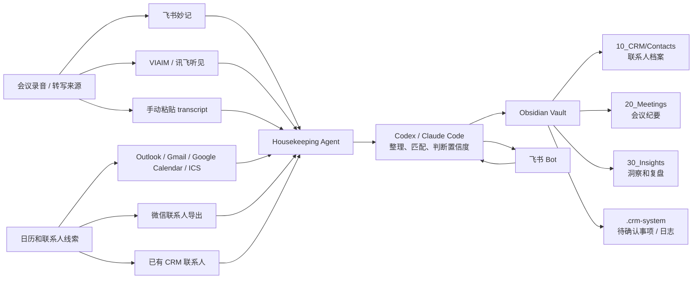

# Personal CRM 系统概览

这份文档面向第一次了解 Personal CRM 的用户。你可以先读这里，再决定是否安装。

Personal CRM 是一个本地优先的个人关系管理和会议记忆系统。它把飞书妙记、VIAIM / 讯飞听见、日历、微信联系人线索和 Obsidian 知识库串起来，让 Codex 或 Claude Code 帮你把会议转写整理成结构化笔记，并自动归档到对应联系人下面。

## 系统示意图



## 它能做什么

### 1. 把 transcript 变成可用的会议纪要

系统不会只生成几句浅摘要。每一份 transcript 会被整理成一篇 Markdown notes，保留尽量准确的事实、数字、人名、公司、观点、风险和行动项。

会议笔记统一命名：

```text
YYYY-MM-DD_人物_主题.md
```

例如：

```text
2026-06-04_Alex-Chen_东南亚渠道合作讨论.md
```

### 2. 自动更新联系人 CRM

每个联系人都有一个 Markdown 文件，放在：

```text
10_CRM/Contacts/
```

联系人文件会记录：

- 姓名、Title、公司；
- 第一次建立联系的时间、地点、背景；
- 对方认识谁、通过谁认识；
- 公司是做什么的；
- 每一次对话的更新；
- 后续跟进事项；
- 关键洞察。

### 3. 用日历帮助判断“这通电话是谁”

录音和 transcript 有时候只有时间，没有准确人名。系统会用日历 block 来辅助匹配：

- 录音时间；
- 日历会议标题；
- 参会人；
- 邮件邀请；
- 已有联系人；
- transcript 里出现的人名、公司名、项目名。

如果匹配置信度高，系统可以自动归档。

如果匹配置信度低，系统不会乱归档，而是问你确认。

### 4. 通过飞书 Bot 做低置信度确认

当系统不确定某份 transcript 应该归到谁下面时，会通过飞书 Bot 问你。

典型问题：

```text
这份会议纪要可能属于以下联系人：

1. Alex Chen
2. Jordan Lee
3. 新联系人

请确认归档对象。
```

你可以直接自然语言回复：

```text
归到 Alex Chen
这个新联系人叫 Alex Chen，Northstar Capital
跳过
```

确认后，系统会：

- 改会议 note 标题里的 `Unknown`；
- 更新 meeting note frontmatter；
- 新建或更新联系人文件；
- 把这次会议追加到联系人对话记录里；
- 标记这条待确认事项已处理。

### 5. 每天自动 housekeeping

系统可以设置一个每天运行的 housekeeping 任务。

它会检查：

- 今天或最近未归档的飞书妙记；
- VIAIM / 讯飞听见 transcript；
- Obsidian inbox 里的新 transcript；
- 待确认归档；
- 新联系人候选；
- 联系人去重和合并建议。

高置信度自动处理，低置信度通过飞书 Bot 问你。

### 6. 在飞书里直接问知识库

如果安装了 Lark Codex bridge，你可以在飞书 Bot 里直接问：

```text
帮我找一下 Northstar Capital 最新一次会议里提到的估值和估值倍数
```

Bot 会把问题交给 Codex，Codex 会优先搜索你的 Obsidian vault，再返回答案，并说明信息来源。

## 核心模块

```text
Personal CRM repo
  scripts/
    personal_crm_install_wizard.py       安装向导
    setup_personal_crm_vault.py          初始化 Obsidian vault
    feishu_bot_agent.py                  飞书 Bot 后端
    lark_codex_bridge.mjs                飞书消息 -> Codex
    install_*_launchd.py                 macOS 常驻服务安装器

  skills/
    crm-housekeeping-agent.skill         每日归档和洞察
    contact-builder.skill                新联系人创建和更新
    viaim-note-sync.skill                VIAIM transcript 导入
    personal-feishu-minutes-reader.skill 飞书妙记读取
    personal-obsidian-crm-archiver.skill 写入 Obsidian
```

## Obsidian 里的知识库结构

安装后会创建：

```text
Personal CRM/
  00_Inbox/
    Transcripts/
    VIAIM/
    FeishuLinks/

  10_CRM/
    Contacts/
    Companies/
    Networks/

  20_Meetings/

  30_Insights/
    Weekly/

  70_Prompts/
  80_Templates/
  90_Attachments/

  .crm-system/
    pending-confirmations.md
    run-log.md
    confirmation-log.md
```

你在 Obsidian 里看到的是普通 Markdown 文件。Codex / Claude Code 也是直接在这些文件上工作。

## 推荐使用方式

### 第一次安装

最简单的命令：

```bash
git clone https://github.com/tedlxz/personal-crm.git && cd personal-crm && python3 scripts/personal_crm_install_wizard.py
```

安装向导会提示你：

- Obsidian vault 放在哪里；
- 是否现在配置飞书；
- 是否安装后台常驻服务。

### 日常使用

你只需要做三类事：

1. 让飞书妙记或 VIAIM 产生 transcript。
2. 每天让 housekeeping agent 自动整理。
3. 遇到低置信度问题时，在飞书 Bot 里确认归档对象。

## 需要哪些账号和授权

| 功能 | 是否必须 | 需要什么 |
| --- | --- | --- |
| Obsidian 本地 vault | 必须 | 本地文件夹 |
| Codex / Claude Code | 必须 | 用来整理 transcript 和写入知识库 |
| 飞书 Bot | 推荐 | Feishu App ID / App Secret |
| 飞书妙记读取 | 可选 | 飞书妙记权限和 OAuth |
| VIAIM / 讯飞听见 | 可选 | 已登录网页或导出的 transcript |
| 日历匹配 | 推荐 | Outlook / Gmail / Google Calendar / ICS 任一来源 |
| 微信联系人线索 | 可选 | 本地导出的联系人或聊天线索 |

## 安全和隐私

- CRM、会议纪要和 transcript 默认保存在本地 Obsidian vault。
- `.env` 保存本地飞书凭证，已经被 `.gitignore` 排除。
- 不要把 `.env`、音频、transcript、联系人 vault 提交到 GitHub。
- 对低置信度归档，系统默认询问用户，不应该自动乱归档。
- 如果飞书 App Secret 曾经暴露，应在飞书开放平台重新生成。

## 当前限制

- VIAIM 网页自动化依赖登录状态和页面结构；如果 VIAIM 改版，需要重新适配。
- 飞书妙记权限可能需要租户管理员审核，即使是个人使用也可能遇到审核流程。
- Outlook 个人邮箱在部分 connector 环境下可能不可用，可以改用 Gmail / Google Calendar / ICS。
- 联系人合并属于高风险动作，系统只生成合并建议，不应自动合并。

## 一句话总结

Personal CRM 的核心不是“存 transcript”，而是把每一次对话变成可检索、可追踪、能沉淀关系和判断的个人知识库。
